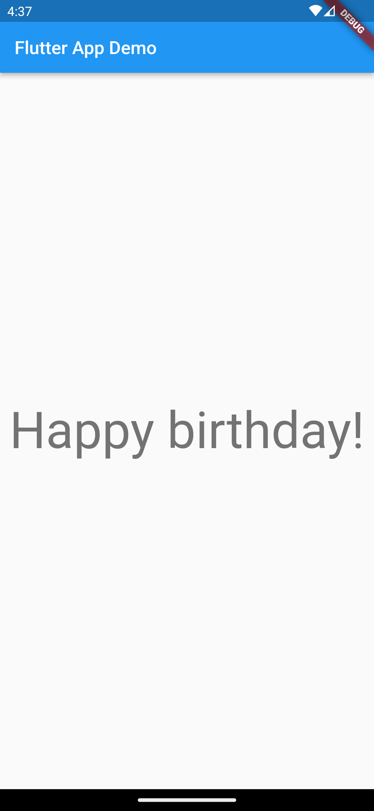
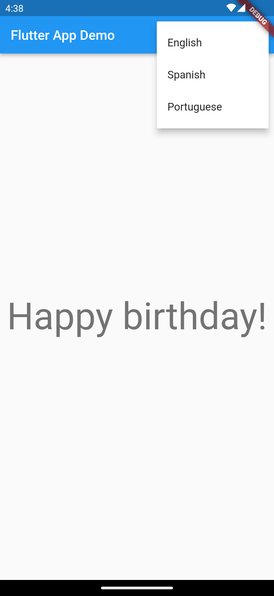

# Flutter Internationalization Study Project
This project is a simple Flutter application built to implement internationalization. It consists of a screen with a centered text that displays "Happy Birthday" according to the device's language in the **master branch**, and the **change_language branch** displays the same text but according to the selected language from the menu item.

## Running the app
Before running the app, make sure to run the following command in the project directory:

``flutter pub get``

``flutter gen-l10n``

This command generates the necessary localization files based on the messages defined in the app. After running this command, you can run the app on your device or emulator.

## Usage
Upon running the app in branch master, you will see a screen with the text "Happy Birthday" centered in the middle of the screen. If your device's language is set to English, this is the text you will see. If you change the language of your device to another supported language, such as Spanish, the text will be displayed in that language.

Upon running the app in branch change_language, you will also see a screen with the text "Happy Birthday" centered in the middle of the screen. But in this case you will see an options menu to choose between English, Spanish and Portuguese languages.

## Contributing
This project is open for contributions. If you find any bugs or want to add a new language or feature, feel free to submit a pull request.
